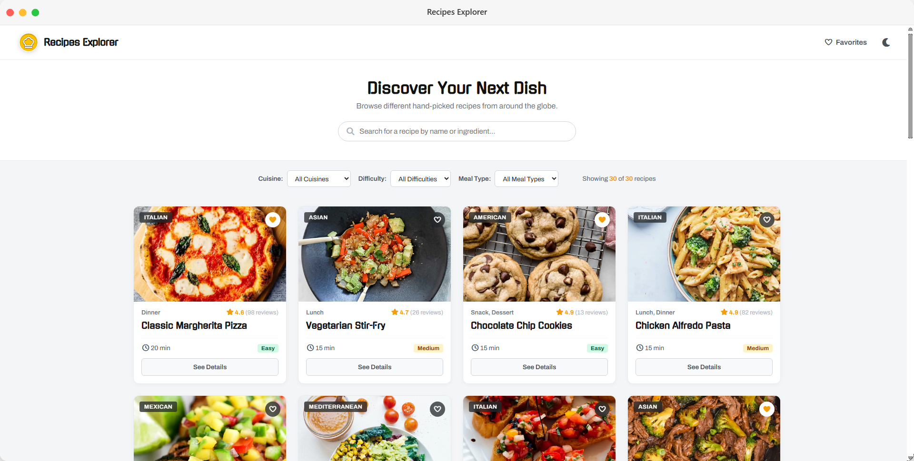
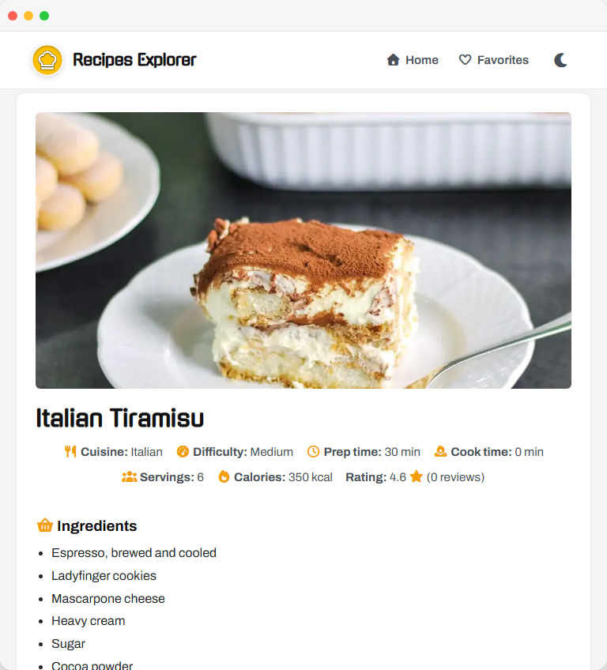
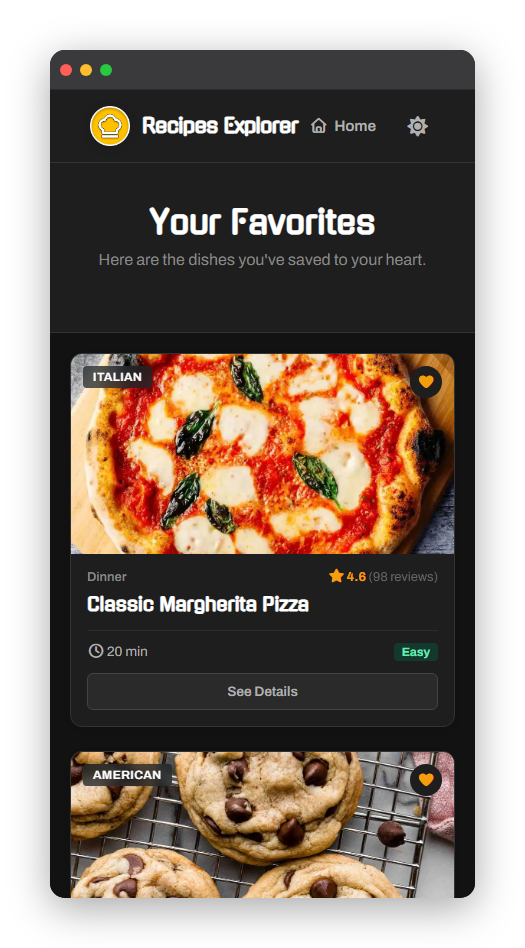

<h1 align="center">
  Recipes Explorer: Dynamic Recipe Catalog
</h1>


<p align="center">
   &nbsp;&nbsp;
   &nbsp;&nbsp;
   &nbsp;&nbsp;
   &nbsp;&nbsp;
  
</p>

## Overview

Ever found yourself staring at the fridge, wondering what to cook? Recipes Explorer is here to help.

This web application connects to the DummyJSON Recipes API to bring you a diverse catalogue of dishes. Search by name, filter by cuisine or difficulty, and dive into detailed instructions, all in a smooth, interactive interface built with vanilla JavaScript and jQuery.

## 📸 Previews

<p align="center">
  
</p>

<p align="center">
  
  &nbsp; &nbsp;
  
</p>

## ✨ Features

- **Dynamic Catalog**: Real-time recipe fetching from DummyJSON.
- **Smart Filters**: Search by name or filter by cuisine, difficulty, and meal type.
- **Theme Switcher**: Persistent Dark/Light mode toggle with `localStorage`.
- **Favorites System**: Save your favorite recipes locally; your choices are saved even after closing the browser.
- **jQuery Animations**: Smooth visual transitions for card loading, favoriting/unfavoriting, and content rendering.
- **Responsive Design**: Clean UI that works across all devices.

## 📂 Project Structure

```text
Recipes-Explorer/
├── assets/
│   ├── css/           # Main styles & FontAwesome
│   ├── js/            # Modular scripts (index, common, favorites, details, theme)
│   ├── imgs/          # Logos & assets
│   └── fonts/         # Local Gugi and Archivo fonts
├── index.html         # Main recipe listing page
├── favorites.html     # User saved recipes
├── recipe-details.html# Single recipe view
└── README.md          # Project documentation
```

## 🚀 How to Run:

### Prerequisites
- Any modern web browser (Chrome, Firefox, Edge, Safari)
- No server required: works directly from file system

### Steps

1. **Clone the repository: **

```bash
git clone https://github.com/ababdelo/Recipes=Explorer.git
cd Recipes=Explorer
```

2. **Open in Browser: **
   Simply open index.html in your preferred web browser. No backend server is required as the application consumes the public DummyJSON API directly.

## 🖥️ Live Demo

> 🔗 **Play it live:** [https://ababdelo.github.io/Recipes=Explorer/](https://ababdelo.github.io/Recipes=Explorer/)

## 🤝 Contributing

Contributions are welcome! Feel free to:

- Fork the repository
- Create a new branch (`git checkout -b features/feature-name`)
- Commit your changes (`git commit -m 'Add feature-name'`)
- Push to the branch (`git push origin features/feature-name`)
- Open a Pull Request

## 📄 License

This project is licensed under the MIT License: see the [LICENSE](license) file for details.

## 🙏 Acknowledgements

- [Font Awesome](https://fontawesome.com/) for the font icons
- [Google Fonts](https://fonts.google.com/) for Gugi && Archivo Mono
- [Dummy JSON](https://dummyjson.com/) for providing the free recipe API
- [StorySet](https://storyset.com/) for providing the free beautifull customized illustrations
- [icons8](https://icons8.com/) for providing the free eastethic icons and logos

## ☎️ Contact

For any inquiries or collaboration opportunities, please reach out to me at:

<p align="center" style="display: inline;">
    <a href="mailto:ababdelo.ed42@gmail.com"> </a>&nbsp;&nbsp;
    <a href="https://www.linkedin.com/in/ababdelo"> </a>&nbsp;&nbsp;
    <a href="https://github.com/ababdelo"> </a>&nbsp;&nbsp;
    <a href="https://www.instagram.com/edunwant42"> </a>&nbsp;&nbsp;
</p>

<p align="center">Thanks for stopping by and taking a peek at my work!</p>
